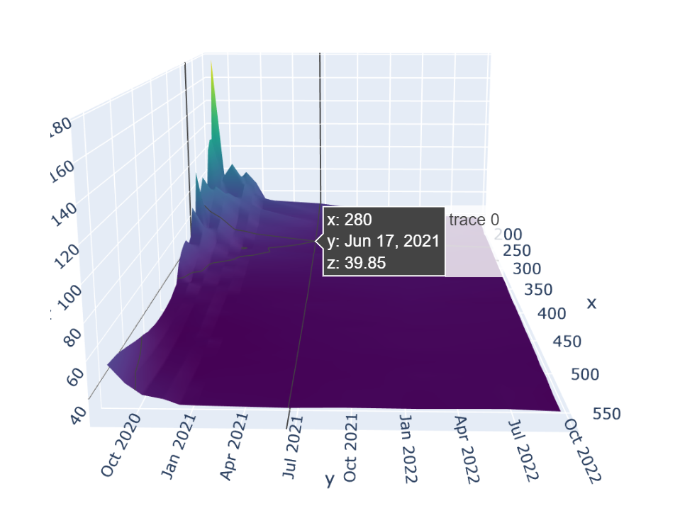
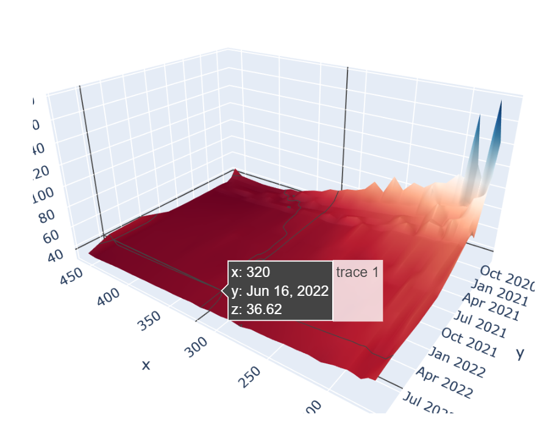
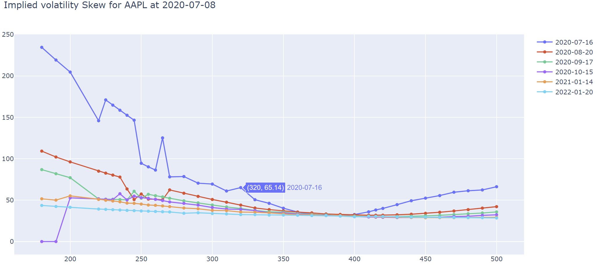
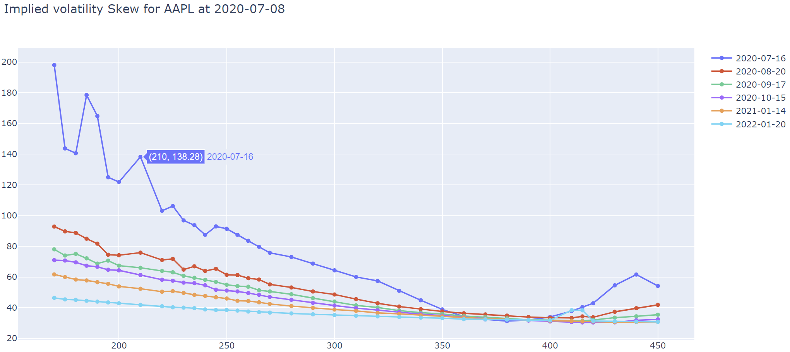

# Implied-Volatility-Surface
Derive implied volatility curves or surface for a specific ticker (e.g. AAPL)

# Demo

## Implied volatility surface

AAPL monthlies call option implied volatility surface:

AAPL monthlies put option implied volatility surface:

## Implied volatility curve 

AAPL call option skew

AAPL put option skew

